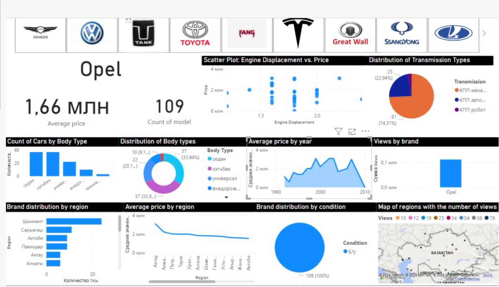

# Web-scraping from Kolesa.kz
The goal of this project is proficiency in using PowerBI to create an insightful and interactive dashboard. This project analyzes data scraped from Kolesa.kz, the leading online marketplace in Kazakhstan for buying and selling vehicles, including cars, trucks, and motorcycles. Kolesa.kz serves as a platform where dealers and private sellers list their vehicles for sale, and buyers can browse these listings to find their desired vehicles.

## Visualisation
_____________

